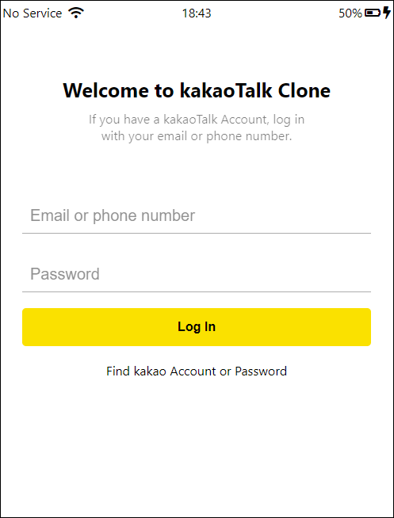
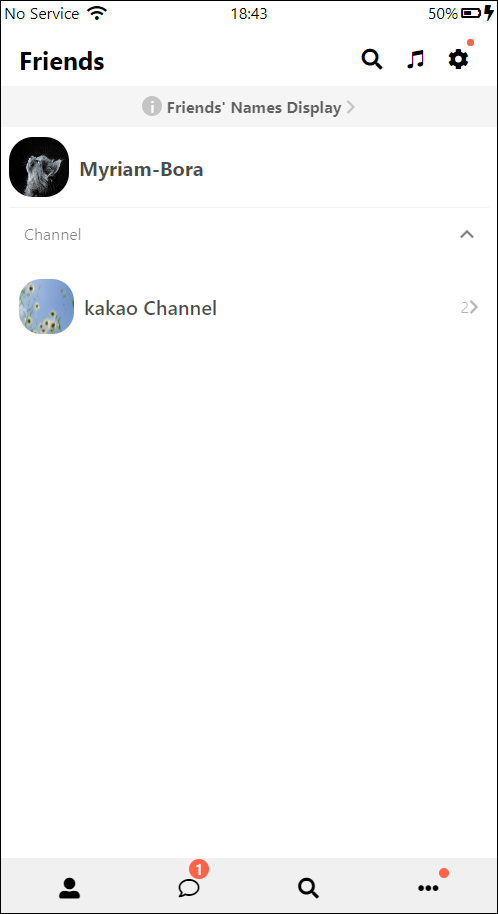
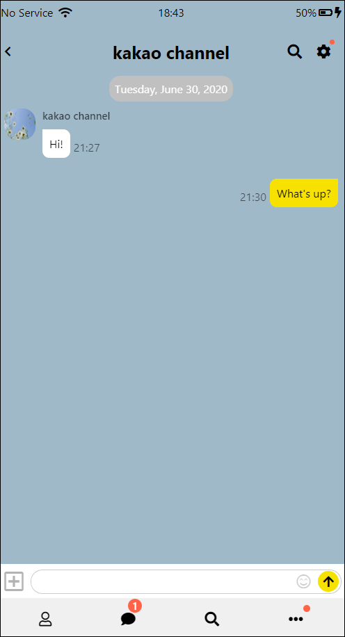
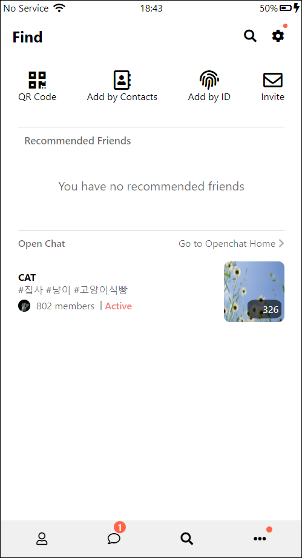
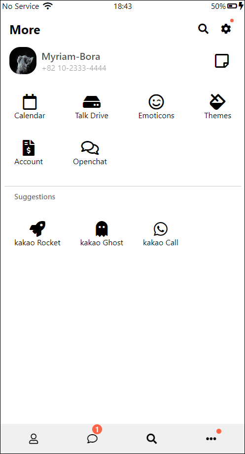

# KaKaoTalk Clone 💬

카카오톡 클론
    

## 사용언어 / 도구

## 사용기술

    ✅ Media Query
    
    ✅ Animations

## Preview 

	✅ Index
  

	 👨‍👩‍👧‍👦 Friends
 

	✉ Chats
 

  	 📃 Chat
 

 	🔍 Find 
 

  
	⚙ More
  

  
 

## Try GitHub Pages 👁‍🗨  

https://myriam-bora.github.io/kakaoTalkClone/
