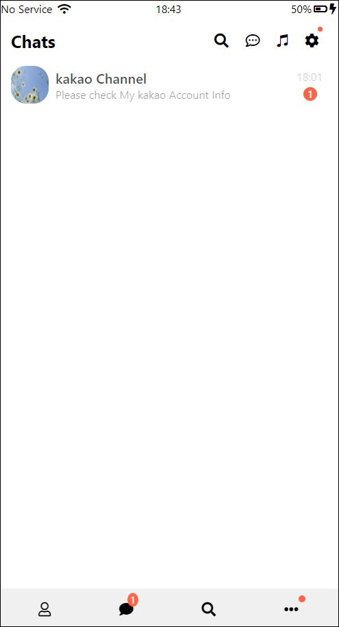

# KaKaoTalk Clone

    ✔ 카카오톡 클론
    

## 사용언어 / 도구

## 주요기능

    ✔ Media Query
   
    ✔ Index
   
   	✔ flex box 
    
    ✔ Pseudo selectors
      
    ✔ Animations

## Preview 

  	
  
  

	 ▪ 👨‍👩‍👧‍👦 Friends
 

	▪   ✉ Chats
 

  	▪  📃 Chat
 

 	▪ 🔍 Find 
 

  
	▪  ⚙ More
  

  
 

## Try GitHub Pages

https://myriam-bora.github.io/kakaoTalkClone/
